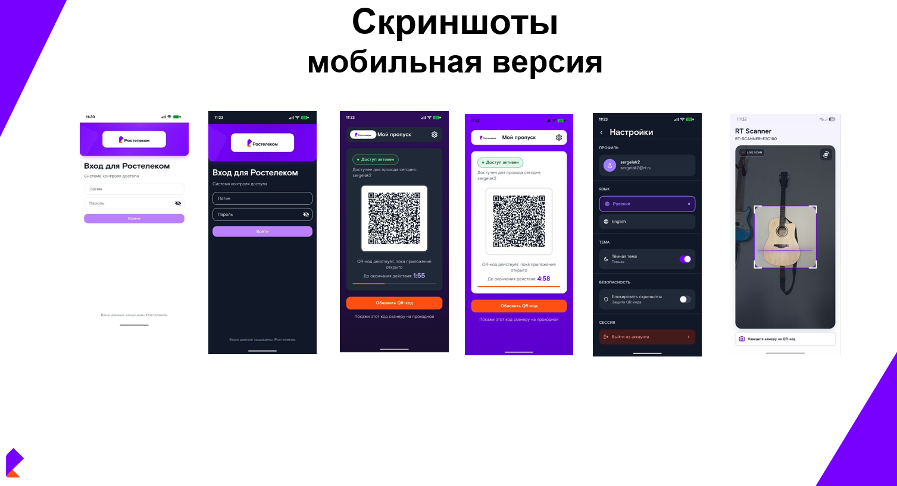
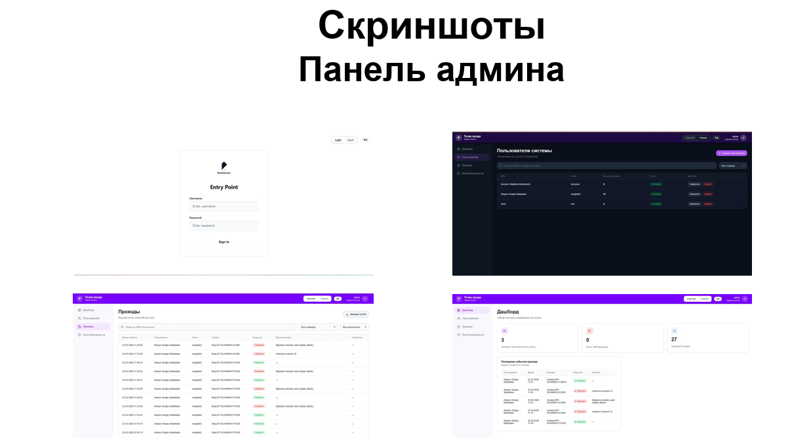
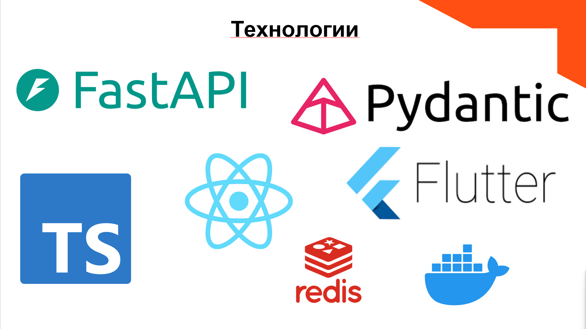
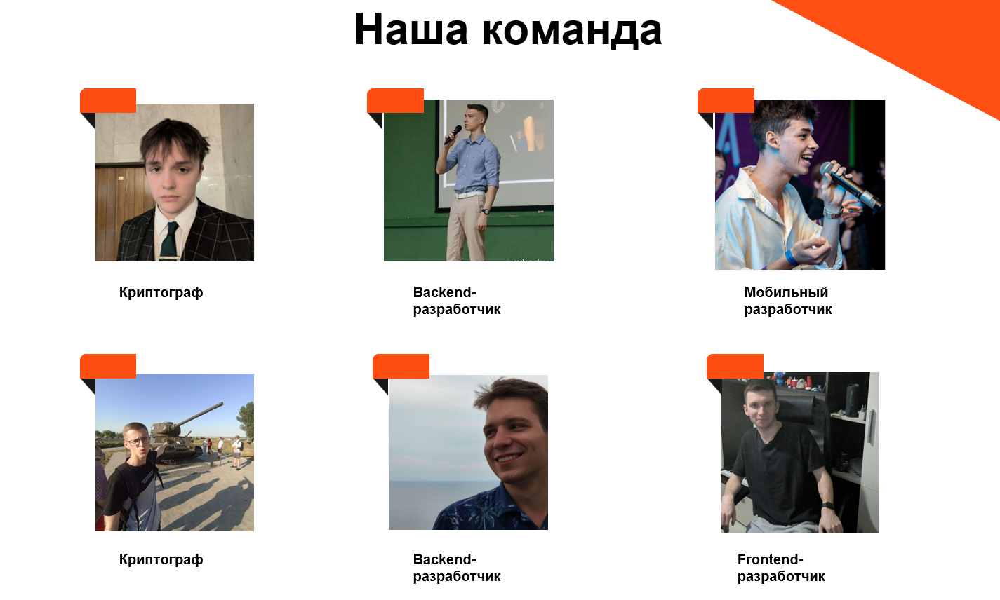

# Entry Point — интеллектуальный пропуск для Ростелекома

> Мобильное приложение и экосистема сервисов для безопасного и удобного доступа на объекты без пластиковых карт и очередей.

## 🏆 О хакатоне

Мы разработали MVP «Точка входа» в рамках хакатона и заняли **2 место** среди команд.  
Фокус был на **серверной логике, криптографическом алгоритме** и корректной работе системы **как онлайн, так и офлайн**.

## 💡 Наше решение — интеллектуальный пропуск

Мы сделали **мобильное приложение**, которое генерирует **динамические, криптографически защищённые QR‑коды**, выступающие в роли пропуска.  
Система опирается на асимметричную криптографию (RSA) и цифровую подпись — безопасно проверяем подлинность кода без хранения чувствительных данных в явном виде.

## 🔐 Как работает алгоритм

| Шаг 1 | Шаг 2 |
|---|---|
|  |  |

## 🏗 Архитектура и компоненты

Проект разделён на несколько сервисов и клиентов:

- **Мобильное приложение** — показывает пользователю его интеллектуальный пропуск, генерирует QR‑коды, умеет работать без постоянного интернета.
- **Backend / Entry Point API** — отвечает за учёт пользователей, управление сессиями, проверку подписей и валидацию доступа.
- **Админ‑панель** — управление сотрудниками, настройка точек входа/выхода, аудит событий.
- **Сканер** — отдельное устройство на вход, на выход или раздельно с разной логикой.

## 📸 Скриншоты

**Мобильное приложение:**

**Панель администратора:**

**Технологический стек:**

## 🧪 Сборки и демонстрации

Мы подготовили сборки и демонстрационное видео, чтобы можно было посмотреть систему «вживую»:

- 📱 **Билд основного мобильного приложения** → https://disk.yandex.ru/d/6qEt0o3J_Pt6Dw
- 🖥 **Билд панели администратора** → https://disk.yandex.ru/d/yuRvK-LvZ7vnkw
- 📷 **Билд демонстрационного сканера** → https://disk.yandex.ru/d/Iug6rXeH0mkOag
- 🎥 **Видео‑демонстрация работы системы** → https://disk.yandex.ru/d/rdmYS6Bwx7z_9A

## 🛠 Технологии

Мы использовали современный стек как на клиенте, так и на сервере:

- **Backend:** FastAPI, Pydantic
- **Mobile:** Flutter
- **Frontend (Admin):** TypeScript, React

## 👥 Команда BALLS

- 🔐 Криптографы
- ⚙️ Backend‑разработчики
- 📱 Мобильный разработчик
- 🖥 Frontend‑разработчик
